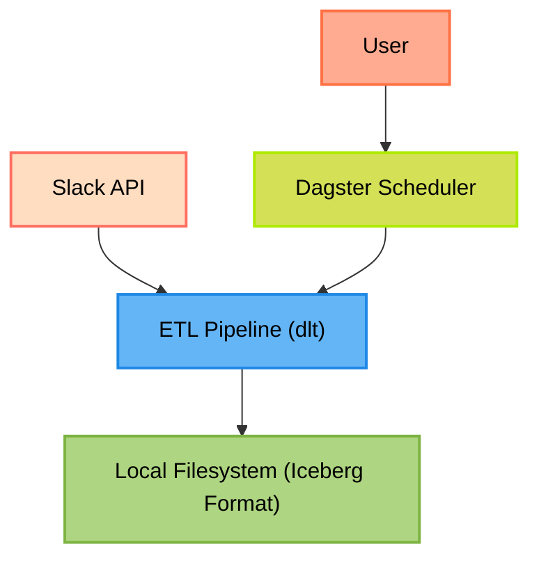

# dlt-iceberg-slack-backup

Proof of concept using dlt & Dagster to save Slack data into Iceberg.



# Getting started

1. Clone this repository (`git clone https://github.com/Kayrnt/dlt-iceberg-slack-backup.git`)
2. [Create a Slack app](https://api.slack.com/apps/new)
3. Under OAuth &amp; Permissions, in the Bot Token Scopes section add the following scopes:
   * `channels:history`
   * `channels:read`
   * `files:read`
   * `groups:history`
   * `groups:read`
   * `users:read`
   * `users:read.email`
4. Keep the Bot User OAuth Token, we'll need it.
5. Under Install App, install the bot to the workspace you'd like to backup.
6. I'm using `uv` to manage the project dependencies (declared in pyproject.toml).
Install uv if needed. Then to install the dependencies, use:
```bash
uv sync
mv .dlt/config.toml.example .dlt/config.toml
mv .dlt/secrets.toml.example .dlt/secrets.toml
mv .env.example .env
```

7. Update the config.toml, secrets.toml and .env files with the appropriate credentials (the bot token)
8. Update the config.yml with `bucket_url` with appropriate path

9. Then to run dagster, use:

```bash
uv run dagster dev
```

10. Then you can find the pipeline in [the assets part](http://127.0.0.1:3000/assets)